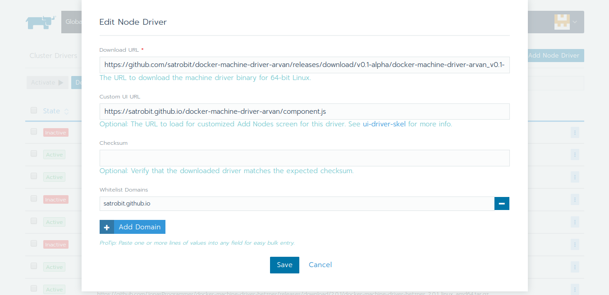
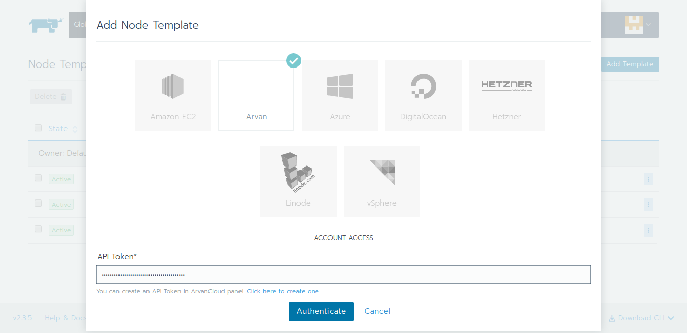
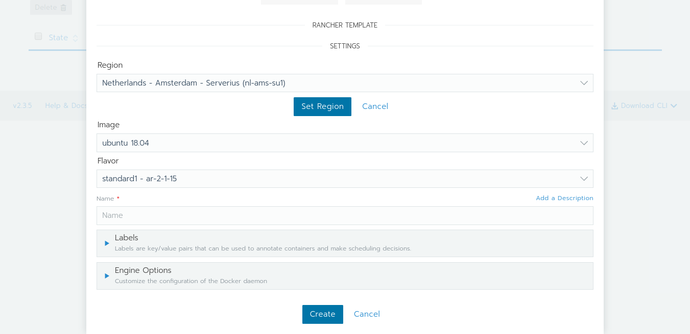
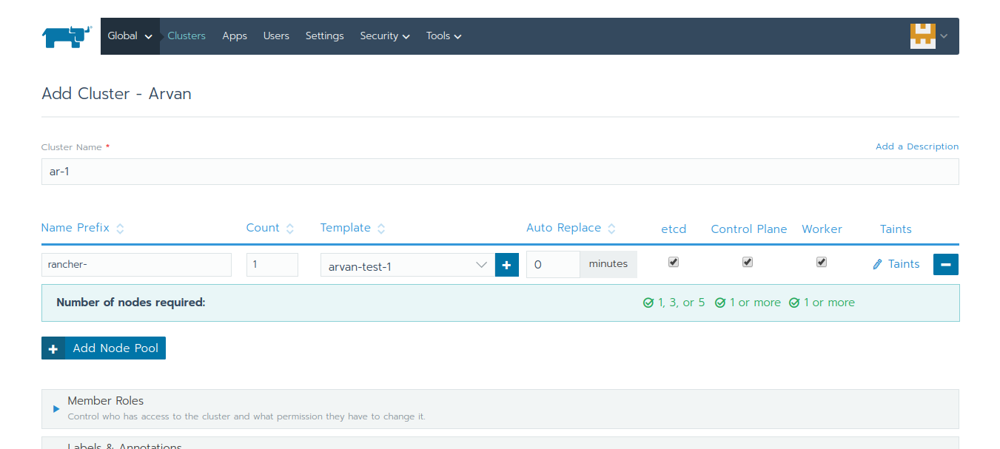

# Rancher UI drvier for ArvanCloud

Rancher UI driver for the [ArvanCloud](https://www.arvancloud.com).

## Usage

* Add a Machine Driver in Rancher (`Tools` -> `Drivers` -> `Node Drivers`)

| Key | Value |
| --- | ----- |
| Download URL | `https://github.com/satrobit/docker-machine-driver-arvan/releases/download/v0.1-alpha/docker-machine-driver-arvan_v0.1-alpha_linux_amd64.tar.gz` |
| Custom UI URL | `https://satrobit.github.io/docker-machine-driver-arvan/component.js` |
| Whitelist Domains |  `satrobit.github.io` |

* Wait for the driver to become "Active"
* Go to Clusters -> Add Cluster, your driver and custom UI should show up.

## Development

This package contains a small web-server that will serve up the ArvanCloud driver UI at `http://localhost:3000/component.js`.  You can run this while developing and point the Rancher settings there.
* `npm start`
* The compiled files are viewable at http://localhost:3000.

## Building

For other users to see your driver, you need to build it and host the output on a server accessible from their browsers.

* `npm run build`
* Copy the contents of the `dist` directory onto a webserver.
  * If your Rancher is configured to use HA or SSL, the server must also be available via HTTPS.
